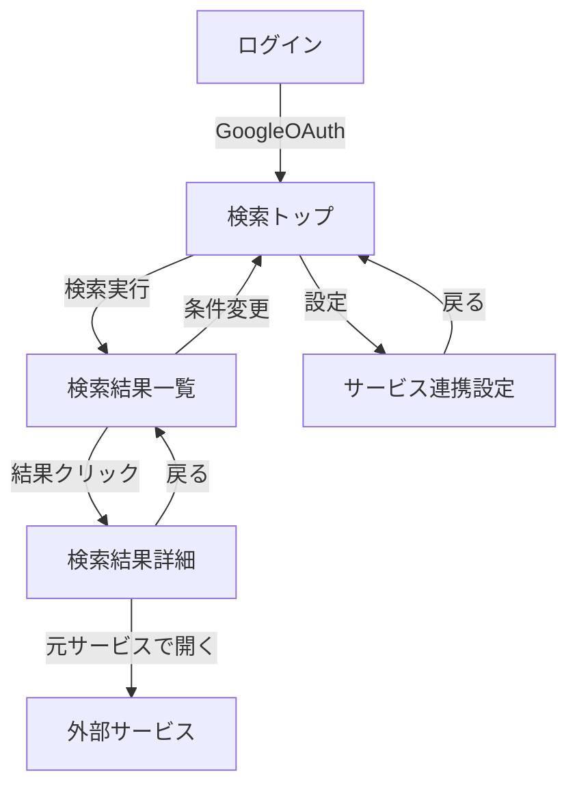

# Claude Code 指示書（V1.0 / V0.1）

これは Claude Code への指示です。

## 前提

- 実行場所：`C:\Users\takag\00_dev\bulk`
- この指示は **V0.1（モックアップ作成）** のみを扱う。別目的の作業を混ぜない。
- ポートは使用しない（静的HTMLを `file://` で開く）。サーバー起動は禁止。
- シークレット情報は扱わない（OAuth 等はモック表示のみ）。

## 目的（V0.1）

MVPの画面イメージを掴むために、以下をローカルに作る。

1. 静的HTMLモック（5画面）
2. 画面遷移図（Mermaidコードを `docs/screen_flow.md` に保存）
3. 各画面のスクリーンショットPNG（自動生成）

## 成果物（作成ファイル）

- `mockups/index.html`（目次・確認用）
- `mockups/login.html`
- `mockups/search.html`
- `mockups/results.html`
- `mockups/detail.html`
- `mockups/settings.html`
- `mockups/styles.css`（共通CSS、CDN禁止）
- `docs/screen_flow.md`（画面遷移図 mermaid）
- `mockups/screenshots/`（PNG一式）
- `scripts/screenshot.mjs`（スクリーンショット生成スクリプト）
- `package.json`（スクショ自動生成用。必要最小限）

## 画面要件（MVPモックの範囲）

### 共通

- 会社全体の利用を想定した「業務ツール」見た目（落ち着いたUI）
- 検索対象：Slack / Gmail / Dropbox / Google Drive（スプレッドシート等は次段階としてUIに“今後”扱いで表示してよい）
- 検索対象は「ファイル名＋本文（Excel/Word/PDF等）＋メール本文＋Slack本文」を想定した文言を含める
- 結果はサービス別タブ、件数バッジ、スニペット（該当箇所の抜粋）
- どの画面も上部に共通ヘッダー（アプリ名、検索窓（結果画面以外は小さめでも可）、設定アイコン、ユーザー表示）

### 1) `login.html`

- 「Googleでログイン」ボタン（機能は不要、UIのみ）
- サブテキスト：検索対象サービス例（Slack / Gmail / Dropbox / Drive）

### 2) `search.html`（検索トップ）

- 中央に大きい検索バー
- サービス絞り込み（チェックボックス）
- 日付範囲（開始/終了）
- ファイル種別（ドキュメント/スプレッドシート/PDF/画像/その他）
- 「検索」ボタン
- 検索履歴（ドロップダウンUIの見た目だけ）

### 3) `results.html`（検索結果一覧）

- サービス別タブ（Slack / Gmail / Dropbox / Drive）＋件数バッジ
- ソート切替（関連度 / 新しい順 / 古い順）
- 結果リスト（20件っぽい見た目、実データはダミーで良い）
- 右側にサイドプレビュー（クリック選択されている体で表示）
- 「もっと見る」ボタン

### 4) `detail.html`（検索結果詳細）

- 対象アイテムのメタ情報（サービス、更新日、作成者等のダミー）
- ファイル/メール/メッセージの本文プレビュー（ダミー）
- 「元サービスで開く」ボタン

### 5) `settings.html`（サービス連携設定）

- Slack / Gmail / Dropbox / Drive の接続状態（接続済み/未接続のダミー）
- 接続/切断ボタン（UIのみ）
- 注意文：各ユーザーの権限範囲内のみ検索できる（他人のデータは見えない）

## 画面遷移図（`docs/screen_flow.md` に保存）

以下の mermaid をそのまま保存する（必要なら文言調整可）。

## スクリーンショット自動生成

### 方針

- Playwright（Chromium）で `mockups/*.html` を `file://` で開いてPNG保存する
- ユーザー操作不要のノンインタラクティブ実行にする

### 手順

1. `package.json` を作成（必要最小限）
2. `npm i -D playwright` を実行
3. `npx playwright install chromium` を実行
4. `scripts/screenshot.mjs` を作成し、以下を満たす
   - `mockups/` の各HTMLを列挙して開く
   - それぞれ `mockups/screenshots/<name>.png` を出力
   - viewport は 1440x900
5. `npm run screenshots` で生成できるようにする

## 完了条件（V0.1の成功条件）

- `mockups/` に5画面HTMLがあり、ブラウザでそれっぽく閲覧できる
- `docs/screen_flow.md` に mermaid がある
- `mockups/screenshots/` に `index.png, login.png, search.png, results.png, detail.png, settings.png` が生成されている

## 実行後に ChatGPT（司令塔）へ返す情報

次を貼り付けて報告する（シークレットは絶対に貼らない）。

- `tree /f` の結果（`mockups/` と `docs/` と `scripts/` が分かる範囲）
- `mockups/screenshots/` のファイル一覧
- `npm run screenshots` の実行ログ（エラーがあれば全文）

